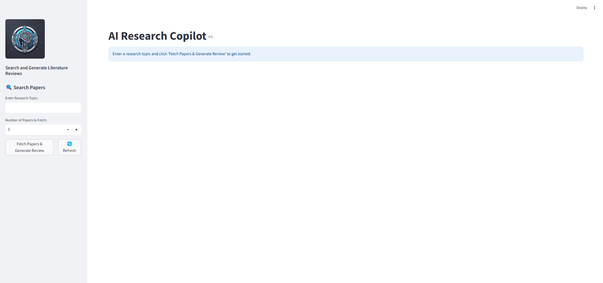

# AI Research Copilot

## Overview
AI Research Copilot is a multi-agent collaborative system that automates the process of finding, downloading, summarizing, and reviewing research papers. Given a topic, the system fetches research papers from arXiv, extracts metadata and summaries, and generates a comprehensive literature review available to download.



## Features
- **Automated Paper Retrieval**: Fetches relevant research papers based on a given topic.
- **Paper Summarization**: Extracts key metadata, abstracts, and summaries from research papers.
- **Literature Review Generation**: Creates a structured literature review with references.
- **Multi-Agent System**: Uses dedicated agents for different tasks, ensuring efficient processing.
- **JSON to PDF Conversion**: Converts structured summaries into PDF format for easy sharing.

## Project Structure

```
research-copilot/               # Main project folder
│── frontend/                   # Frontend directory
│   ├── app.py                   # Streamlit or frontend application
│
│── backend/                     # Backend directory
│   ├── main.py                   # Main backend script
│   ├── pdf_from_json.py          # Converts JSON output to PDF
│   ├── utils.py                  # Utility functions
│   │
│   ├── agents/                   # Agents folder
│   │   ├── summarization_agent.py
│   │   ├── review_generation_agent.py
│   │
│   ├── tools/                    # Tools folder
│   │   ├── paper_download_tool.py
│   │
│   ├── workflows/                # Workflows folder
│   │   ├── research_workflow.py
│
│── requirements.txt              # Dependencies
│── .env                          # Environment variables
│── LICENSE                       # License file
│── README.md                     # Documentation
```

## Installation

1. **Clone the Repository**
```sh
 git clone https://github.com/aminajavaid30/research-copilot.git
```

2. **Navigate to the Project Directory**
```sh
 cd research-copilot
```

3. **Install Dependencies**
```sh
 pip install -r requirements.txt
```

4. **Set Up Environment Variables**
   - Create a `.env` file in the root directory.
   - Add API keys and other required configurations.

5. **Run the Backend**
```sh
 cd backend
 uvicorn main:app --reload 
```

6. **Run the Frontend**
```sh
 cd frontend
 streamlit run app.py
```

## Usage
1. **Enter a research topic** in the frontend application.
2. **The system will retrieve and download relevant papers from arXiv**.
3. **Summarization Agent** extracts metadata and key information from the research papers.
4. **Review Generation Agent** generates a structured literature review.
5. **The final output is available in JSON and PDF formats**.

## How It Works
1. **Summarization Agent**: Fetches research papers from arXiv, extracts metadata, and summarizes content.
2. **Paper Download Tool**: Downloads research papers in PDF format.
3. **Review Generation Agent**: Generates a structured literature review based on extracted summaries.
4. **Research Workflow**: Orchestrates the interaction between agents to automate the research process.

## Technologies Used
- **Python** (Backend)
- **Streamlit** (Frontend UI)
- **FastAPI** (Backend API)
- **agno** (Agent framework)
- **LLM (Meta Llama 3.3-70B) - Together API** for summarization & review generation
- **ArXivTools** for paper retrieval
- **JSON/PDF** for structured output

## Future Enhancements
- ✅ **Support for Multiple Research Sources** (e.g., Semantic Scholar, IEEE Xplore)
- ✅ **Enhanced Citation Formatting** (BibTeX, APA, MLA)
- ✅ **Database Storage for Research Papers**
- ✅ **Interactive Chat Agent to Ask Questions from the Papers**

## License
This project is licensed under the MIT License.

## Contributors
- **Amina Javaid** ([@https://github.com/aminajavaid30](https://github.com/aminajavaid30/research-copilot))
